# Camera attitude: yaw, pitch, roll

## Where they come from

Every angle in the output is read from the **image's XMP metadata**, by
[`parse_img_info()`](../dji_geotagger/core/xml_parser.py).

They are not derived from GNSS. A single antenna gives position, not
orientation; the angles are DJI's own IMU and gimbal solution, passed
through. This tool improves the *position* of each photo by an order of
magnitude and leaves the *orientation* at whatever the aircraft recorded.

## Two sets of angles in every DJI image

| XMP field | Refers to |
|-----------|-----------|
| `FlightYawDegree` / `FlightPitchDegree` / `FlightRollDegree` | The **aircraft** body |
| `GimbalYawDegree` / `GimbalPitchDegree` / `GimbalRollDegree` | The **camera**, after the gimbal has absorbed aircraft motion |

Both are read and both are kept. Only the **gimbal** set is normalized into
the `DGT_*` columns, because the camera is what took the picture — on a
stabilized gimbal the aircraft can be pitched several degrees into the wind
while the camera stays nadir, and it is the camera's orientation that
describes the image.

## The frames

Both sets are referenced to the local **NED** frame, and the body axes are
DJI's own:

> "the **X axis is directed through the front** of the aircraft and the
> **Y axis through the right**. Using the coordinate right hand rule, the
> **Z axis is then through the bottom**. […] When describing rotational
> movement, the X, Y and Z axes are renamed **Roll, Pitch and Yaw**."
>
> "A heading angle of 0° will point toward the North, and +90° toward the
> East."
>
> — [DJI Mobile SDK, Flight Control → Coordinate Systems](https://developer.dji.com/mobile-sdk/documentation/introduction/flightController_concepts.html)

The gimbal has its own three axes and is stabilised about all of them, which
is why its attitude is reported separately from the aircraft's: yaw about the
vertical mount, pitch about the horizontal axis through the camera, and roll
about the optical axis.

The rotation sequence is **intrinsic Z-Y-X** (yaw, then pitch, then roll),
taking the camera body into the local NED frame:

$$R = R_z(\psi) R_y(\theta) R_x(\phi)$$

Stated in the *Matrice 4 Series* manual (p. 89) as "NED coordinate system,
the rotation order is ZYX", and confirmed against the data rather than taken
on trust: it is the reading under which frames taken seconds apart on the
same flight line, with the same independently measured aircraft heading,
describe the same physical orientation.

## What the normalization does

```mermaid
flowchart TD
    IN["<code>GimbalYaw / Pitch / RollDegree</code>"]
    W1["<b>1.</b> wrap all three into &#177;180&deg;"]
    Q{"<b>2.</b> is roll beyond &#177;90&deg;?"}
    F["yaw += 180&deg;<br>roll += 180&deg;<br><i>absorb the flip</i>"]
    P["<b>3.</b> pitch += 90&deg;<br><i>nadir &#8722;90&deg; &rarr; 0&deg;</i>"]
    W2["<b>4.</b> wrap yaw into 0&#8211;360&deg;"]
    OUT["<code>DGT_Yaw / Pitch / RollDegree</code>"]

    IN --> W1 --> Q
    Q -- yes --> F --> P
    Q -- no --> P
    P --> W2 --> OUT

    classDef branch fill:#fdf3e0,stroke:#a86a00
    class Q,F branch
```

[`_format_orientation()`](../dji_geotagger/core/xml_parser.py) applies four
steps to the gimbal angles:

**1. Wrap all three into [−180°, 180°).**

**2. Absorb a 180° roll flip.** If `|roll| > 90°`:

$$\text{yaw} \leftarrow \text{yaw} + 180^\circ, \qquad \text{roll} \leftarrow \text{roll} + 180^\circ$$

**3. Shift pitch to the photogrammetric convention.**

$$\text{pitch}_{\text{DGT}} = \text{pitch}_{\text{DJI}} + 90^\circ$$

**4. Wrap yaw into [0°, 360°).**

### Why step 3

DJI writes **nadir as −90°**: gimbal pitch is measured from the horizon,
downward negative. Photogrammetric conventions — Metashape's among them —
write **nadir as 0°**. Adding 90° converts one to the other, so a
straight-down frame reads `0` and an oblique reads its depression angle
directly.

| Camera points | `GimbalPitchDegree` | `DGT_PitchDegree` |
|---|---|---|
| level, at the horizon | 0° | +90° |
| 45° oblique | −45° | +45° |
| straight down (nadir) | −90° | 0° |

### Why step 2

At pitch = ±90° a Z-Y-X decomposition is in **gimbal lock**: the yaw and roll
axes become parallel, so only their sum is determined by the rotation and the
split between them is not. DJI's nadir is exactly that singularity, which is
why the same physical orientation can be reported as roll ≈ 0° on one frame
and roll ≈ 180° on the next, with yaw jumping 180° to compensate.

Adding 180° to both moves their sum by 360°, leaving the rotation unchanged
while expressing it with roll near 0. Left uncorrected, a survey looks as
though the camera turned upside down between shots, and any conversion to
omega-phi-kappa inherits the discontinuity.

**The correction is exact only at the singularity.** Away from ±90° pitch the
general Z-Y-X identity also reflects pitch about 90°, which step 2 does not
do, and the resulting rotation error grows as twice the off-nadir angle. In
the reference data that combination never occurs — every flipped frame is at
nadir, and every oblique frame reports roll 0 — so the branch fires only
where it is valid. If you meet a frame with large roll *and* a pitch away
from ±90°, check it, and consider `add_format_orientation=False` on
[`parse_img_dir()`](../dji_geotagger/core/xml_parser.py) to keep the raw
angles.

## What the columns mean

| Column | Range | Convention |
|--------|-------|------------|
| `DGT_YawDegree` | 0-360° | Camera heading, clockwise from true north |
| `DGT_PitchDegree` | degrees | **0 = nadir**, positive looking up toward the horizon |
| `DGT_RollDegree` | degrees | 0 = level; near 0 preferred over near 180 |

A lawnmower pattern should come out with two yaw clusters 180° apart, the
outbound and return legs. That is the cheapest sanity check available.

## Building a rotation matrix

**This tool never forms one.** It normalizes the three numbers and writes
them out; the only rotation matrices in the code move the lever arm and the
covariance between frames, described in
[the pipeline note](pipeline.md#frames-and-rotations).

To build $R$ yourself, use the sequence above, and note one trap:

**Use the DJI pitch, not the DGT pitch.** `DGT_PitchDegree` has already had
90° added for reporting, so feeding it into $R_y$ points the camera a quarter
turn away from where it was looking:

$$\theta = \text{DGT pitch} - 90^\circ$$

Chaining onto the frame conversion gives the orientation in ECEF. Writing
$R_{\text{ne}}$ for the NED → ECEF rotation of
[the pipeline note](pipeline.md#ned-to-ecef):

$$R_{\text{ECEF}} = R_{\text{ne}}(\varphi, \lambda) R(\psi, \theta, \phi)$$

using that exposure's own latitude and longitude for the first factor — the
same per-record local frame the lever arm uses.

Two things this does not settle, and which a self-calibrating bundle
adjustment is the right place to solve:

- **The camera-to-body mapping.** The angles describe the gimbal body.
  Photogrammetric software usually defines camera axes as $x$ right, $y$
  down, $z$ along the viewing direction, which is not DJI's body frame, so
  the mapping between them is not the identity.
- **Boresight.** The fixed angular offset between the gimbal's reported zero
  and the camera's optical axis is not measured anywhere in this pipeline.

## What is not done

- **No omega-phi-kappa conversion.** OPK depends on the target coordinate
  system's axes and on the camera-to-body convention of the receiving
  software. Doing it here would mean guessing both.
- **No boresight calibration.**
- **No uncertainty.** Unlike the positions, the angles carry no reported
  sigma. DJI publishes none, and inventing one would be worse than its
  absence.
- **No smoothing or interpolation.** Each image keeps the angles written into
  it. They are metadata, not a solved trajectory.

Treat the angles as **initial values for a bundle adjustment**, not as a
final exterior orientation. The positions in this pipeline are survey-grade;
the angles are as good as the gimbal was.

See also [How a camera centre is computed](pipeline.md).
