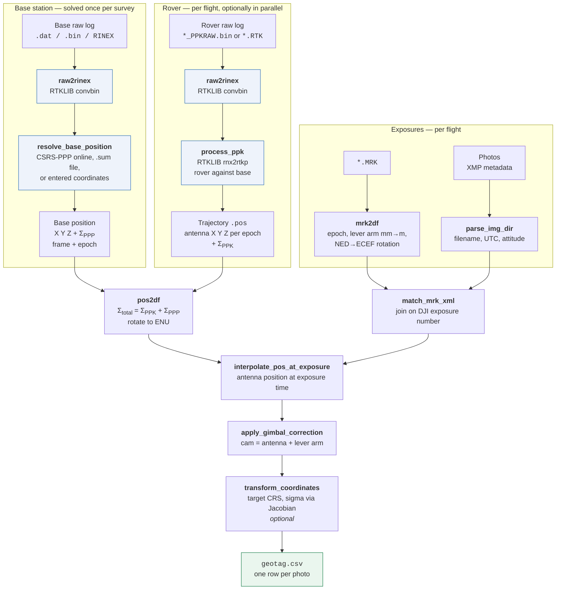

# How a camera centre is computed

From raw GNSS logs to one row per photo. Every box names the function that
does the work, so the diagram and the code can be read against each other.

## The whole chain

## Why in that order

**The base is resolved first, once.** Every flight inherits the same base
coordinate, so solving it per flight would be both slower and a way to end up
with flights on subtly different foundations. It also fails fast: a bad base
position surfaces before RTKLIB spends minutes on the first flight.

**PPP fixes the frame; PPK fixes the geometry.** CSRS-PPP gives the base an
absolute position in a named frame at a named epoch. PPK gives the rover's
position *relative to that base*, to centimetres. Neither alone is enough —
PPP on a moving rover is far weaker, and PPK without an absolute base gives
you a precisely-shaped trajectory in the wrong place.

**The MRK supplies time, not position.** What the exposure table needs from
the MRK is *when* each shutter fired and *where the camera was relative to
the antenna*. Its own lat/lon/height — the aircraft's real-time RTK answer —
are exactly what post-processing replaces.

**Interpolation happens before the lever arm.** The trajectory is sampled at
the GNSS rate, the shutter fires between samples, so the antenna position is
linearly interpolated to the exposure epoch first. Only then is the lever arm
added, because the lever arm belongs to that instant.

## The base antenna height

The height you measure in the field is written into the RINEX header as
`ANTENNA: DELTA H/E/N`, and from there it is **subtracted once and added back
once**:

| Step | What the coordinate refers to |
|---|---|
| Header carries `H = 2.0000` | — |
| CSRS-PPP applies it, echoing an `ARP` line in the `.sum` | the **marker** on the ground |
| `ant2-pos` in the RTKLIB config | the marker |
| `ant2-antdelu` from the same header | RTKLIB puts the antenna back above it |

[`read_antenna_delta()`](../dji_geotagger/ppk/ppk_solver.py) reads the offset
back out of the header rather than taking it as an argument, so both ends come
from one source and cannot drift apart. Get this wrong in only one place and
every camera centre moves by the antenna height.

**Setting the antenna height to zero is also valid**, and is one fewer step to
get wrong: CSRS-PPP then reports the antenna reference point directly, RTKLIB
adds nothing back, and the chain has no offset in it at all. The cost is that
the resulting coordinate describes the ARP rather than the ground mark, so
**that point cannot be used as a control or check point** without adding the
height back by hand — which moves the risk from the file to the person.

Either is defensible. Entering the height keeps the delivered base coordinate
physically meaningful; entering zero keeps the arithmetic minimal.

## Frames and rotations

Three frames appear in the pipeline, and every conversion between them is a
pure rotation — no translation, because they all share an origin at the point
being converted.

| Frame | Axes | Used for |
|-------|------|----------|
| **ECEF** | X through 0°N 0°E, Z through the pole | Everything is combined here |
| **NED** | North, East, **Down** | How DJI writes the MRK offsets |
| **ENU** | East, North, **Up** | How the uncertainty is reported |

NED and ENU describe the same tangent plane at $(\varphi, \lambda)$; they
differ only in axis order and in the sign of the vertical.

### How DJI writes the offset

The MRK's fields 4-6 are tagged `,N` `,E` `,V` and carry **millimetres**. The
`V` is vertical, **positive downward** — so it is the D of NED, not the U of
ENU. A record reading `106,N  -556,E  300,V` means the camera sits 0.106 m
north, 0.556 m *west* and 0.300 m *below* the antenna phase centre.

That vector is not a fixed mounting constant. It is measured per exposure,
because the gimbal moves.

### NED to ECEF

The columns of the rotation are the ECEF representations of the local unit
vectors. For latitude $\varphi$ and longitude $\lambda$:

$$
\hat{e}_N = \begin{bmatrix} -\sin\varphi\cos\lambda \\\\ -\sin\varphi\sin\lambda \\\\ \cos\varphi \end{bmatrix}
\qquad
\hat{e}_E = \begin{bmatrix} -\sin\lambda \\\\ \cos\lambda \\\\ 0 \end{bmatrix}
\qquad
\hat{e}_U = \begin{bmatrix} \cos\varphi\cos\lambda \\\\ \cos\varphi\sin\lambda \\\\ \sin\varphi \end{bmatrix}
$$

Stacking them as $[\hat{e}_N \mid \hat{e}_E \mid -\hat{e}_U]$ — the minus
because D points opposite to U — gives what
[`NED2ECEF_vec()`](../dji_geotagger/tools/tools.py) implements:

$$
\begin{bmatrix} \Delta X \\\\ \Delta Y \\\\ \Delta Z \end{bmatrix}
=
\begin{bmatrix}
-\sin\varphi\cos\lambda & -\sin\lambda & -\cos\varphi\cos\lambda \\\\
-\sin\varphi\sin\lambda & \cos\lambda & -\cos\varphi\sin\lambda \\\\
\cos\varphi & 0 & -\sin\varphi
\end{bmatrix}
\begin{bmatrix} \Delta N \\\\ \Delta E \\\\ \Delta D \end{bmatrix}
$$

That 3×3 is the NED → ECEF rotation, written $R$ from here on.

$\varphi$ and $\lambda$ are that exposure's own latitude and longitude, taken
from the MRK. The frame is local, so it has to be rebuilt for every record —
a single rotation for the whole flight would be wrong by the angle the Earth
curves through over the survey.

$R$ is orthonormal, so the offset's length is unchanged by the conversion.
That gives a free check on the sign convention: the camera centre's
ellipsoidal height must drop by exactly the MRK's Down offset. Get D
backwards and every camera lands two Down-offsets too high.

### The same basis, used backwards, for the covariance

The uncertainty travels the other way. `ECEF2ENU_vec()` uses
$[\hat{e}_E \mid \hat{e}_N \mid \hat{e}_U]^{\top}$ and applies it as a
congruence rather than to a vector, because a covariance transforms as
$R \Sigma R^{\top}$, not as $R x$. `ENU2ECEF_vec()` is its exact inverse —
$R$ is orthonormal, so the transpose is the inverse.

## Which photo is which exposure

The MRK records exposures; the folder holds photos. Nothing in either file
links them directly, so the join is on DJI's own exposure number — the MRK's
first column, and the four-digit field in the file name.

The obvious alternative, pairing the *n*th photo with the *n*th MRK record,
is wrong often enough to matter. It assumes the folder starts at `0001`, and
two cases here do not: an L2 folder begins at `0003`, and a P1 folder left
behind by an aborted flight held only `0002`. In the first, every photo is
paired with the exposure two shutter intervals away — several metres of
flying — and the overhang at the end is dropped; in the second the single
photo matches nothing and the folder yields no rows at all. Neither failure
announces itself, because the counts still look nearly right.

Measured over one survey, all 27 folders: pairing by name changes nothing in
any of the twelve P1 folders that begin at `0001`, recovers the one that does
not, and corrects every L2 folder — the L2 never begins at `0001`.

Photos renamed out of the DJI convention fall back to sorted position, which
is the only thing left to go on.

**The rover log is named by payload.** A P1 folder holds one `*_PPKRAW.bin`;
an L2 folder holds one `*.RTK` instead, among a dozen sidecars of its own.
Both are RTCM 3 carrying the same MSM5 observations and ephemerides, so only
the name differs. The L2's other sidecars are not RTCM — `.RTB` included,
despite the name.

## Placing an exposure on the trajectory

The PPK solution is a time series at the GNSS rate; the shutter fires between
epochs. [`interpolate_pos_at_exposure()`](../dji_geotagger/core/camera_pos_solver.py)
resolves that, and treats position and uncertainty differently on purpose.

**Position is interpolated linearly** in each ECEF component over GPS
time-of-week. Over one epoch gap the trajectory is close enough to straight
that a higher-order fit would add complexity without accuracy — but the
residual curvature *is* a real error, and it is one of the terms deliberately
absent from the reported sigma.

**Covariance is not interpolated.** The exposure takes the covariance of the
**nearest** epoch, because a covariance matrix is not a quantity that can be
averaged into another one and stay meaningful: interpolating between two
matrices can produce something that is not a valid covariance at all.
Neighbouring epochs of a fixed solution differ little in any case.

**Out of coverage is NaN, never extrapolation.** An exposure before the first
or after the last PPK epoch gets NaN position and NaN sigma. Extending the
trajectory past its ends would produce a plausible-looking number with no
observation behind it, which is worse than an obvious gap.

**A gap longer than five seconds is refused too.** Being inside the overall
span is not the same as being observed once several flights are joined, and
interpolating across a break between two sorties would return a confident
position that nothing supports. Five seconds sits above the short dropouts a
real trajectory contains — two to three seconds were measured on the
reference survey — and far below any genuine break.

### One recording, several files

DJI rolls the photo folder every 999 images and starts a new GNSS file at the
same time, but closes the old one a few seconds *before* the last exposures
are written into that folder. Measured across one session: the observation
files abut to within a single 5 Hz epoch, so the recording never stopped —
yet each folder's last one to eight exposures were observed only in the next
folder's file.

Solved folder by folder, those exposures have no trajectory to land on and
come out empty. So the trajectories are **merged before any exposure is
placed**: every flight is solved independently, as before, and the results are
concatenated and sorted into the single recording they came from.

If a flight's neighbour is not part of the run, its observations are still
needed. `geotag()` accepts `extra_obs_folders` for exactly that: those folders
are solved for their trajectory alone and produce no rows. The desktop front
end works out which neighbours abut the selection and passes them, so
processing a subset of a survey does not quietly lose the exposures at its
edges.

## What travels with the coordinates

Three things are carried through every step and end up in the output, because
a coordinate without them cannot be checked or reused:

- **`coord_sys`** — the frame, in full (`NAD83(CSRS)v8 / UTM zone 12N`)
- **`epoch`** — which the frame refers to; a frame without an epoch cannot be
  rigorously transformed
- **`sigma_E/N/U`** — the combined uncertainty, at the confidence level asked
  for

## Where it can produce nothing

Three failure modes are deliberate NaNs rather than errors, because one bad
exposure should not lose a flight:

| Condition | Effect |
|-----------|--------|
| Exposure outside the PPK time span | Position and sigma NaN for that row; never extrapolated |
| MRK and photo counts disagree | Inner join; unmatched rows dropped, count logged |
| RTKLIB reports an indefinite covariance | That epoch takes its nearest valid neighbour's covariance |

A flight that fails outright is skipped and named in
`geotag_df.attrs["failed_flights"]`; the others still finish.

## The uncertainty model

$$\Sigma_{\text{total}} = \Sigma_{\text{PPK}} + \Sigma_{\text{PPP}}$$

$$\Sigma_{\text{ENU}} = R \Sigma_{\text{total}} R^{\top}$$

Summed as full 3×3 matrices in ECEF, so inter-axis correlations survive, then
rotated into local ENU by the same basis the lever arm uses. Adding is
legitimate because the two terms are **independent**: rover-to-base geometry
and base-to-datum are solved from different observations.

Everything stored internally is **1σ**, which is what makes a single
multiplier legitimate later.

### What Σ_PPP contains

From the CSRS-PPP `.sum`, parsed by
[`sum_file_parser()`](../dji_geotagger/ppk/PPP_sum_parser.py):

- The **PPP solution sigma** for X, Y, Z, published at 95% and divided by
  1.96 on the way in.
- The **published correlations**, so Σ_PPP is a real covariance matrix rather
  than three independent numbers.
- The **epoch-propagation term**, when it applies. Asking CSRS-PPP for NAD83
  at a fixed epoch adds a `SIG_TOT(95%)` column beside `SIG_PPP(95%)`: the
  extra uncertainty of moving the coordinate through time on a velocity grid.
  On a 15.6-year propagation it contributed 0.75–1.10 cm (1σ) — the same
  order as the solution itself, so it is not optional.

  It is added as an **independent diagonal term**,
  $\sigma_{\text{tot}}^2 - \sigma_{\text{ppp}}^2$, rather than by rescaling
  the correlations. The `.sum` publishes correlations for the PPP solution
  and says nothing about the propagation term, so putting it on the diagonal
  adds no cross-axis structure the file did not state. Whether the
  velocity-grid error is in fact correlated across axes has not been
  investigated here; if it is, Σ_PPP is imperfect off-diagonal by an
  unquantified amount.

What it does **not** contain:

- The accuracy of the reference frame's own realization.
- Any error in the antenna height you measured with a tape.
- Cross-axis correlation of the epoch-propagation term, as above.

### When you supply the base position yourself

[`resolve_base_position(mode="manual", ...)`](../dji_geotagger/ppk/base_position.py)
takes `sigma_ENU` as 1σ metres, and it is **required to be strictly
positive**. Two consequences worth understanding before choosing a number:

**It lands on every photo.** Σ_PPP is added to every epoch of every flight,
so it is a floor under the whole survey — a systematic term, not a random
one. Under-stating it makes thousands of images look better than they are.

**Zero is refused.** A zero sigma asserts a perfectly known base station, and
every downstream uncertainty would be optimistic by exactly the amount you
failed to state — a silent error in the one number a user checks to decide
whether to trust the result. There is no way to detect it afterwards from the
output.

If the uncertainty is genuinely unknown, pass `sigma_ENU=None`. That
**disables base error propagation** rather than assuming zero: the reported
sigmas then cover the PPK solution only, and `uncertainty_available` is False
so the limitation travels with the data. A conservative estimate is still
better than none; `None` is for when nothing at all is known.

For a published control point, use the datasheet values. Failing that,
something deliberately conservative such as (0.02, 0.02, 0.04) m.

### The k factor

Everything is stored at 1σ so that a confidence level can be applied once, at
the end. CSRS-PPP publishes 95%, so it is divided by 1.96 on the way in —
undoing its *k* to recover the standard deviation, not applying a new one.
That reading assumes the published 95% is a two-sided normal interval **per
component**, which is how the `.sum` presents it: a separate sigma per axis
alongside a correlation matrix.

Applying a confidence level is then a multiplication, and which multiplier is
correct depends on **how many components the statement covers**:

| | 1σ (68.27%) | 90% | 95% | 99% |
|---|---|---|---|---|
| **1-D** per component | 1.000 | 1.645 | 1.960 | 2.576 |
| **2-D** horizontal | 1.515 | 2.146 | 2.448 | 3.035 |
| **3-D** spatial | 1.878 | 2.500 | 2.795 | 3.368 |

Each entry is $\sqrt{\chi^2_{df}(p)}$ — the square root of the chi-square
quantile at probability $p$, with $df$ equal to the number of components the
statement covers. For $df = 1, 2, 3$ that is the normal, Rayleigh and Maxwell
distribution respectively.

`sigma_E/N/U` are per component, so the **1-D row** is the one that applies.
Quoting a 2-D value per axis overstates each axis by 25% at 95%; conversely,
a column scaled with k = 1.960 covers 95% on each axis but only 85% of a
horizontal ellipse and 72% of a 3-D one.

Two details that matter more than they look:

- **Rescaling renames.** `sigma_E` becomes `sigma_E_95`. Writing a 95% figure
  into a column still called `sigma_E` hands the next reader a number wrong
  by a factor of two with nothing on the file to say so.
- **Second moments are left alone.** With `full_output`, `cov_total_ECEF` and
  `sigma_total_ECEF` stay at 1σ, because scaling a variance needs $k^2$ and a
  half-converted file is worse than an unconverted one.

### Reading Σ_PPK with care

RTKLIB's per-epoch covariance is a **formal** precision from its Kalman
filter. It describes the geometry and the filter's own noise model, not
whether the ambiguities were resolved correctly. A confidently wrong fixed
solution reports a small sigma.

The `.pos` encodes off-diagonals as signed square roots, and those six
numbers occasionally contradict each other — implying a correlation above 1,
which cannot exist. [`pos2df()`](../dji_geotagger/core/pos_parser.py) tests
each matrix for positive semi-definiteness and substitutes the nearest valid
epoch's matrix, flagging the row in `cov_repaired`. Positions are never
altered. Adding a positive definite base covariance would mask the defect
rather than fix it, which is why the check runs first.

### What is not in the number

The reported sigma is a **lower bound**. Not propagated:

- **Interpolation between GNSS epochs.** Real, and it grows with the square
  of the gap; in the tail of a survey — turns at the end of flight lines — it
  can exceed the reported sigma.
- **Camera/GNSS clock offset.** The MRK timestamp is taken as exact.
- **Lever-arm error.** The MRK offset is taken as exact; gimbal encoder error
  and the antenna phase-centre model are not modelled.
- **The coordinate transformation's own accuracy.** PROJ states one for the
  operation it chose; it is recorded in `df.attrs["transform"]` but not added
  to the covariance.
- **The antenna phase centre.** GNSS measures to the antenna's *electrical*
  phase centre, and reducing that to a physical point takes a calibration.
  DJI publishes a mechanical height — the D-RTK 3's phase centre sits 10 cm
  above the top of the survey pole — which is enough to keep the height
  bookkeeping straight and is worth applying. It publishes no ANTEX model, so
  CSRS-PPP reports `ANT NOT FOUND` and neither it nor RTKLIB applies a
  phase-centre correction. What is left is systematic, almost entirely
  vertical, and does **not** cancel between base and rover, because the two
  antennas are different hardware. Harmless for relative work; visible as a
  constant against external control.
- **Attitude.** Carries no uncertainty at all. DJI publishes an *Angular
  Vibration Range* of ±0.01° for the Zenmuse P1 gimbal, which is how still it
  holds, **not** how well it knows where it is pointing; no absolute attitude
  accuracy is published for either the gimbal or the flight controller. See
  [Camera attitude](attitude.md).

See also [Camera attitude](attitude.md) for where yaw, pitch and roll come
from.
